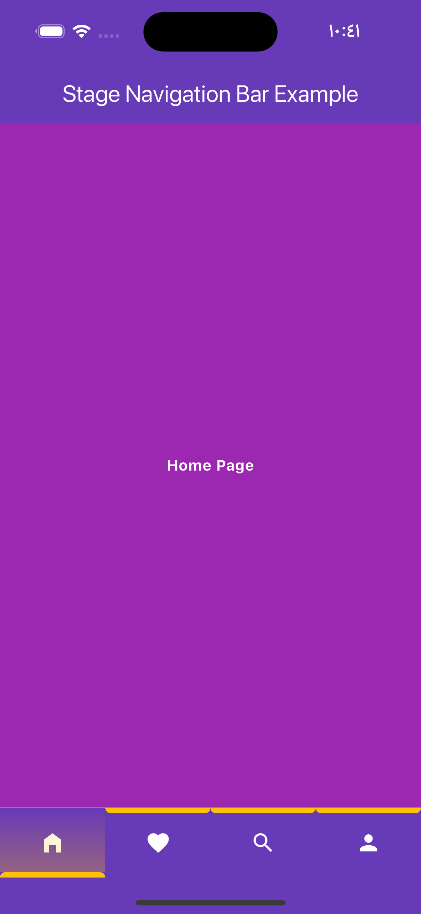

<!--
This README describes the package. If you publish this package to pub.dev,
this README's contents appear on the landing page for your package.

For information about how to write a good package README, see the guide for
[writing package pages](https://dart.dev/guides/libraries/writing-package-pages).

For general information about developing packages, see the Dart guide for
[creating packages](https://dart.dev/guides/libraries/create-library-packages)
and the Flutter guide for
[developing packages and plugins](https://flutter.dev/developing-packages).
-->


A beautiful navigation bar with animation when select item.


## Table of contents

1. [Installing](#installing)
2. [How To Use](#how_to_use)
3. [Showcase](#showcase)
4. [Example Project](#example)
5. [Contributors](#contributors)

## 🖥  Installing <a name="installing"></a>

### Add Dependency
```yaml
dependencies:
  stage_navigation_bar: ^0.0.1 #latest version
```

### Import Package
```dart
import 'package:stage_navigation_bar/stage_navigation_bar.dart';
```

## ℹ️ How To Use <a name="how_to_use"></a>

Place your `StageNavigationBar` to the `bottomNavigationBar` slot of a `Scaffold`. Or in the bottom
of your main page view.

**❗️ It works with 2 or more navigation items.**

### Code
```dart
class StageNavigationBarExample extends StatefulWidget {
  const StageNavigationBarExample({super.key});

  @override
  State<StageNavigationBarExample> createState() =>
      _StageNavigationBarExampleState();
}

class _StageNavigationBarExampleState extends State<StageNavigationBarExample> {
  /// Your initial page
  int _selectedIndex = 0;

  @override
  Widget build(BuildContext context) {
    return Scaffold(
      bottomNavigationBar: StageNavigationBar(
        items: const [
          Icon(Icons.home_filled, color: Colors.white),
          Icon(Icons.favorite, color: Colors.white),
          Icon(Icons.search, color: Colors.white),
          Icon(Icons.person, color: Colors.white),
        ],
        selectedIndex: _selectedIndex,
        indicatorColor: Colors.amber,
        onTap: (int index) {
          setState(() {
            _selectedIndex = index;
          });
        },
      ),
    );
  }
}
```

### Properties
- `itemEntering`: Define the animation move shape when tap.
- `alignment`: Alignment of the item inside the shadow colors.
- `itemHeight`: The height of each item.
- `indicatorHeight`: Indicator height.
- `indicatorColor`*: The color of the indicator and the shadow degrees.
- `selectedIndex`*: Current selected index.
- `items`*: `StageNavigationBar` items, must be >= 2.
- `onTap`*: On item tap.
- `barWidth`: `StageNavigationBar` width.
- `itemPadding`: The padding of each item.
- `barPadding`?: `StageNavigationBar` internal padding.
- `barMargin`?: `StageNavigationBar` external padding.
- `duration`: The transition duration.
- `decoration`?: `StageNavigationBar` box decoration.

### Default values
- `itemEntering = StageNavigationEntering.top`,
- `alignment = Alignment.center`,
- `itemHeight = 60`,
- `indicatorHeight = 5`,
- `barWidth = double.infinity`
- `itemPadding = const EdgeInsets.all(0)`,
- `duration = const Duration(milliseconds: 200)`,

### StageNavigationEntering Values
```dart
StageNavigationEntering.top
StageNavigationEntering.center
StageNavigationEntering.bottom
```

### Event
```dart
onTap: (index){

}
```

## 🕹 Showcase <a name="showcase"></a>

**StageNavigationEntering**

```dart
itemEntering: StageNavigationEntering.top
```


---
```dart
itemEntering: StageNavigationEntering.center
```


---

```dart
itemEntering: StageNavigationEntering.bottom
```


## 📱 Example Project <a name="example"></a>

[Pub Example Project](https://pub.dev/packages/stage_navigation_bar/example)

[Github Example Project](https://github.com/mu7mmd/stage_navigation_bar/tree/main/example)



## 👨🏻‍💻 Contributors <a name="contributors"></a>

Mohammad Alamoudi [@mu7mmd](https://github.com/mu7mmd)
